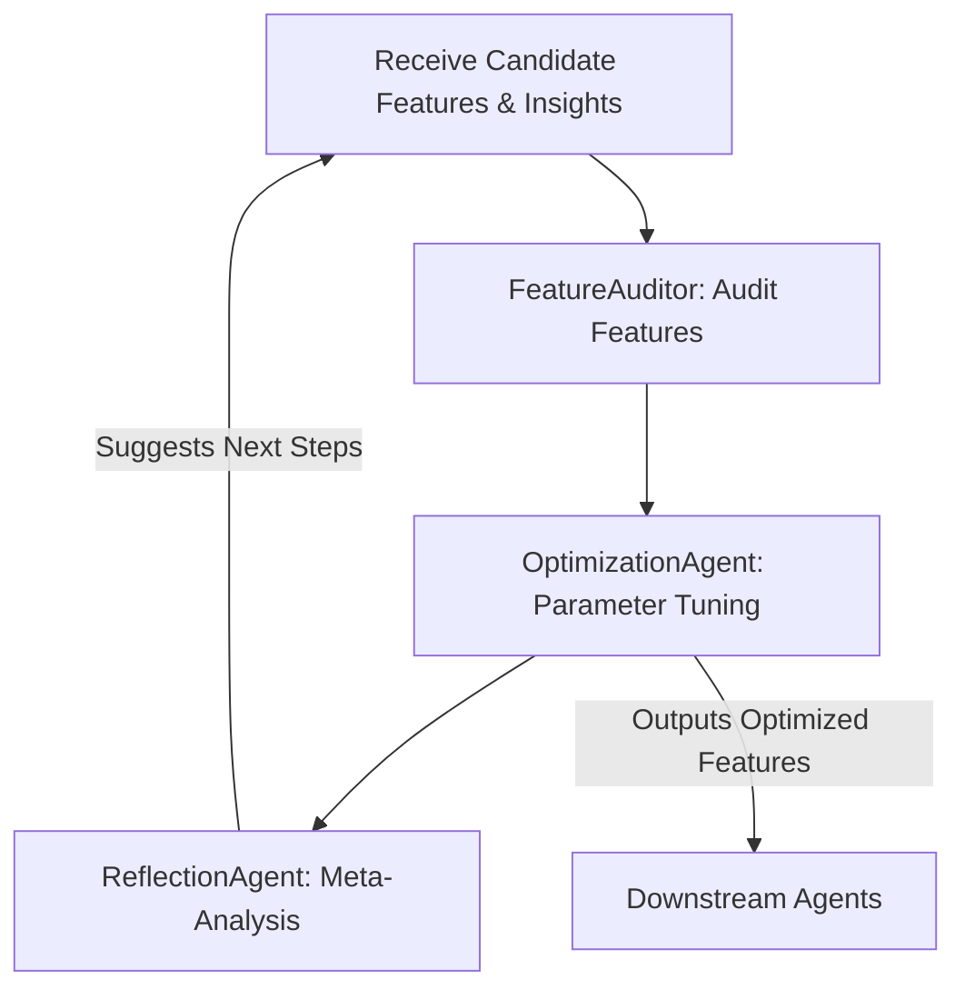
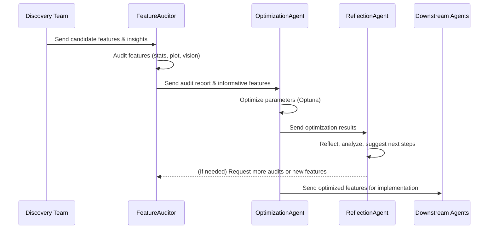

# Strategy Team Manual

The **Strategy Team** is responsible for transforming raw insights into actionable, high-quality features through a rigorous, multi-stage process. This team consists of three specialized agents, each with distinct roles and toolsets. The workflow is collaborative, iterative, and designed for both robustness and extensibility.

## Team Composition and Roles

| Agent Name         | Role                                                                 | Primary Tools                                   |
|--------------------|----------------------------------------------------------------------|-------------------------------------------------|
| FeatureAuditor     | Audits candidate features for correctness, novelty, and impact       | `run_sql_query`, `audit_feature`, `add_audit_note` |
| OptimizationAgent  | Tunes feature parameters using bilevel optimization (Optuna)         | `run_optimization`, `suggest_hyperparameters`   |
| ReflectionAgent    | Analyzes past runs and informs future strategies (meta-learning)     | `analyze_run_history`, `suggest_strategy`       |

---

## Detailed Step-by-Step Workflow

### 1. Receive Candidate Features & Insights
- **Input:** Structured insights and candidate features from the Discovery Team.
- **Format:** List of feature specifications, each with metadata (source insight, rationale, SQL/Python implementation).

### 2. FeatureAuditor: Audit Features
- **Purpose:** Assess the quality, novelty, and informativeness of each candidate feature.
- **Process:**
    1. **Compute Summary Statistics:** Uses `compute_summary_stats` to analyze feature distributions.
    2. **Generate Plots:** Calls `create_plot` to visualize feature distributions (e.g., histograms).
    3. **Vision Analysis:** Invokes a vision model on generated plots for qualitative assessment.
    4. **Informativeness Filter:** Flags features as informative/non-informative based on data coverage and variance.
    5. **Audit Notes:** Uses `add_audit_note` to document findings and recommendations.
- **Output:** Structured audit report for each feature (including stats, plots, vision summary, and informativeness flag).

#### Example Table: Feature Audit Output
| Feature         | Stats Summary | Plot Path        | Vision Summary         | Informative |
|-----------------|--------------|------------------|------------------------|-------------|
| `feat_A`        | ...          | `plots/feat_A.png`| "Distinct bimodal..." | Yes         |

### 3. OptimizationAgent: Parameter Tuning
- **Purpose:** Tune hyperparameters of candidate features to maximize downstream model performance.
- **Process:**
    1. **Setup Optimization:** Loads feature configs and initializes Optuna study.
    2. **Objective Function:** Defines a scoring function (e.g., AUC, RMSE) using k-fold cross-validation.
    3. **Parameter Sampling:** Uses `suggest_hyperparameters` to sample feature parameters per trial.
    4. **Model Training:** Trains LightFM (or other recommender) on each fold.
    5. **Early Stopping & Pruning:** Implements Optuna pruning for efficiency.
    6. **Logging & Visualization:** Logs results to TensorBoard and saves optimization logs.
    7. **Feature Importances:** Computes parameter importances post-optimization.
- **Output:**
    - Best parameter set for each feature
    - Optimization logs and trial results
    - Feature importance scores

#### Example Table: Optimization Output
| Feature         | Best Params         | Best Score | Importance |
|-----------------|--------------------|------------|------------|
| `feat_A`        | `{bin=10}`         | 0.812      | 0.45       |

### 4. ReflectionAgent: Meta-Analysis & Strategy
- **Purpose:** Analyze the results of the current pipeline iteration and recommend next steps.
- **Process:**
    1. **Gather Artifacts:** Loads insights, hypotheses, audit reports, and optimization results from `SessionState`.
    2. **Prompt Engineering:** Uses a structured prompt to instruct the LLM on what to reflect on.
    3. **LLM Reflection:** Runs a chat session (via autogen) to:
        - Evaluate the quality and completeness of current features
        - Identify gaps or areas for further exploration
        - Decide whether to continue, stop, or pivot
    4. **Summary Logging:** Writes results to TensorBoard and logs detailed reasoning.
- **Output:**
    - `should_continue` (bool)
    - `reasoning` (str)
    - `next_steps` (list)

#### Example Table: Reflection Output
| Should Continue | Reasoning                        | Next Steps                      |
|-----------------|----------------------------------|---------------------------------|
| True            | "Feature set is promising..."    | ["Audit more genre features"]   |

---

## Tools & Access for Each Agent

### FeatureAuditor
- **run_sql_query:** Executes SQL queries on DuckDB to fetch feature data.
- **audit_feature:** Runs the full audit pipeline (stats, plot, vision, informativeness).
- **add_audit_note:** Appends structured notes to the audit report.

### OptimizationAgent
- **run_optimization:** Launches Optuna-based parameter search, logs all trials.
- **suggest_hyperparameters:** Samples and proposes new parameter sets per trial.

### ReflectionAgent
- **analyze_run_history:** Loads all artifacts from `SessionState` for meta-analysis.
- **suggest_strategy:** Uses LLM to propose next steps for the pipeline.

---

## Interaction Diagram (Detailed)

---

## Example End-to-End Flow
1. **Discovery Team** generates a new feature: `genre_popularity`.
2. **FeatureAuditor** computes stats, generates a histogram, and runs vision analysis.
3. If `genre_popularity` is informative, **OptimizationAgent** tunes its bin size and normalization method.
4. **ReflectionAgent** reviews the audit and optimization results, recommends further tuning or exploration if needed.
5. Optimized, validated features are passed to **Downstream Agents** for realization and evaluation.

---

> **Note:** All steps are logged and tracked in the `SessionState` for full reproducibility and agentic traceability.
