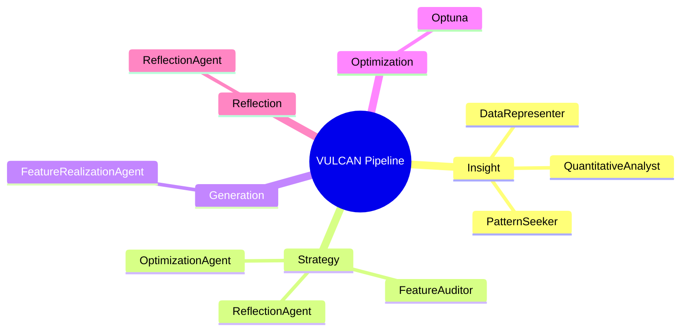

# System Architecture

VULCAN is a multi-phase pipeline for autonomous feature engineering, composed of specialized agents collaborating in structured group chats. The pipeline phases are:

1. **Insight (Discovery)**: Agents perform EDA, create SQL views, and surface novel patterns.
2. **Strategy**: Agents propose, evaluate, and refine candidate features.
3. **Generation/Realization**: Features are implemented in Python and validated.
4. **Optimization**: Features are tuned using bilevel optimization (Optuna).
5. **Reflection**: The system analyzes past runs to guide future iterations.

## Central Orchestration
- **orchestrator.py**: Coordinates all phases, manages agent group chats, and maintains the `SessionState`.
- **SessionState**: Tracks all run artifacts, agent outputs, and shared memory.

## Pipeline Mindmap (Mermaid)

## Key Modules
- `src/agents/` — Agent definitions
- `src/orchestration/` — Orchestration logic for each phase
- `src/utils/session_state.py` — Run/session state management
- `src/schemas/models.py` — Data models
